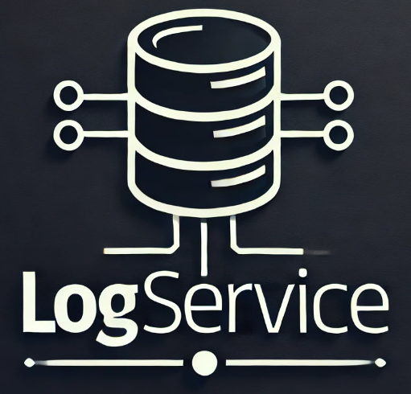

# 📝 LogService - System Rejestrowania Logów

<p align="center">
  
</p>

## 📌 Opis Projektu
**LogService** to nowoczesny mikroserwis napisany w **ASP.NET Core 8.0**, który umożliwia **zapisywanie, przeglądanie oraz filtrowanie logów aplikacyjnych**.  

Aplikacja jest w pełni konteneryzowana i działa w środowisku **Docker**, umożliwiając łatwe wdrażanie oraz skalowanie.  
Dane przechowywane są w **Microsoft SQL Server**, a interfejs API obsługiwany jest przez **Swagger** oraz **Postman**.

---

## 🚀 **Technologie**
- **C# / .NET 8.0** - główny backend aplikacji
- **ASP.NET Core Web API** - REST API do obsługi logów
- **Entity Framework Core 8.0** - ORM do operacji na bazie danych
- **MSSQL Server 2022** - baza danych do przechowywania logów
- **Docker & Docker Compose** - konteneryzacja aplikacji
- **Postman / Swagger** - testowanie API

---

## 📡 **Działanie aplikacji**
1. **LogService** odbiera żądania od innych aplikacji lub systemów, rejestrując logi w bazie danych.
2. Każdy log zawiera:
   - 📅 **Czas utworzenia**
   - 📂 **Poziom logu**
   - ✉️ **Treść logu**
   - 👤 **Użytkownik generujący log (opcjonalnie)**
   - ❗ **Szczegóły wyjątku (jeśli wystąpił)**
3. API umożliwia:
   - **Dodawanie nowych logów** (`POST /api/logs`)
   - **Pobieranie wszystkich logów** (`GET /api/logs`)
   - **Filtrowanie logów** (po dacie, poziomie, użytkowniku)
   - **Eksport logów do formatu JSON**
4. **Swagger** umożliwia interaktywne testowanie API.

---

## ⚙️ **Konfiguracja i Uruchomienie**

### 1️⃣ **Klonowanie Repozytorium**
```bash
git clone https://github.com/Dominik99d14/LogService.git
cd LogService

```

---

## 📞 Kontakt

W razie pytań lub sugestii, proszę o kontakt:

<p align="left">
  <strong>Dominik Kowalczyk:</strong> <a href="mailto:dominik99d14@gmail.com">dominik99d14@gmail.com</a>
</p>
